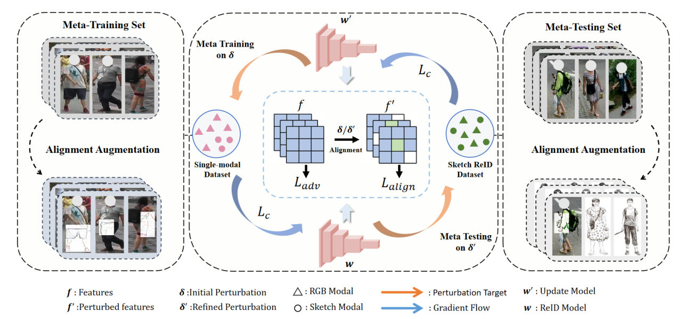

<h2 align="center">A Theory-Inspired Framework for Few-Shot Cross-Modal Sketch Person Re-Identification
</h2>

<p align="center"> Yunpeng Gong<sup>1</sup>, Yongjie Hou<sup>2</sup>, Jiangming Shi<sup>3</sup>, Kim Long Diep<sup>1</sup>, Min Jiang<sup>1,*</sup>
</p>

<p align="center">1. School of Informatics, Xiamen University &nbsp; <br> 2. School of Electronic Science and Engineering, Xiamen University &nbsp; <br> 3. Institute of Artificial Intelligence, Xiamen University
</p>

<div align="center">
</image>
</div>

## Dataset

Download <a href="https://github.com/Lin-Kayla/subjectivity-sketch-reid">MaSk1K dataset</a> (Short for <u>Ma</u>rket-<u>Sk</u>etch-<u>1K</u>), <a href="https://zheng-lab-anu.github.io/Project/project_reid.html">Market1501 dataset</a>, and <a href="https://github.com/vana77/Market-1501_Attribute.git">Market1501 attributes</a>. Put MaSk1K and Market1501 separately into your \<data_path\>.

## Guidence

### Requirements
download the necessary dependencies using cmd.
```bash
pip install -r requirements.txt
```

### Preprocess
```python
python preprocess.py \
  --data_path=<data_path> \
  --train_style <train_style> \
  [--train_mq]
```

 - `<data_path>` should be replaced with the path to your data.
 - `<train_style>` refers to the styles you want to include in your training set. You can use any combination of styles A-F, such as B, AC, CEF, and so on.
-  `[--train_mq]` argument is optional and can be used to enable multi-query during training.

### Start training
```
python train.py \
  --meta_train_data_path=<market1501_dataset_path> \
  --meta_test_data_path=<mask1k_dataset_path> \
  --train_style <train_style> \
  --test_style <test_style> \
  [--train_mq] \
  [--test_mq]
```

 - `<market1501_dataset_path>` and `<mask1k_dataset_path>` should be path of the datasets.
 - `<train_style>` and `<test_style>` should be replaced with the styles you want to use for your training and testing sets, respectively. Just like in the preprocessing step, you can use any combination of styles A-F.
 - `[--train_mq]` argument is used for enabling multi-query during training, and `[--test_mq]` serves a similar purpose during testing.

### Evaluation
```python
python test.py \
  --train_style <train_style> \
  --test_style <test_style> \
  --resume <model_filename> \
  [--test-mq]
```
 - `<train_style>` should be replaced with the styles you used for your training.
 - `<test_style>` should be replaced with the styles you want to use for your testing.
 - `<model_filename>` should be the filename of your trained model.
 - `[--test_mq]` argument is used for enabling multi-query during testing.

## Acknowledgements
This code provides a comparison with the <a href="https://github.com/Lin-Kayla/subjectivity-sketch-reid">ssreid (subjectivity-sketch-reid)</a> with <a href="https://github.com/openai/CLIP.git">CLIP</a>. 

## Citation
If you find our work helpful, please consider citing our work using the following bibtex.
```
@inproceedings{gong2026,
  title={A Theory-Inspired Framework for Few-Shot Cross-Modal Sketch Person Re-Identification},
  author={Yunpeng Gong, Yongjie Hou, Jiangming Shi, Kim Long Diep, Min Jiang},
  booktitle={AAAI},
  year={2026},
}
```


## Contact Me

Email: 1286670508@qq.com


